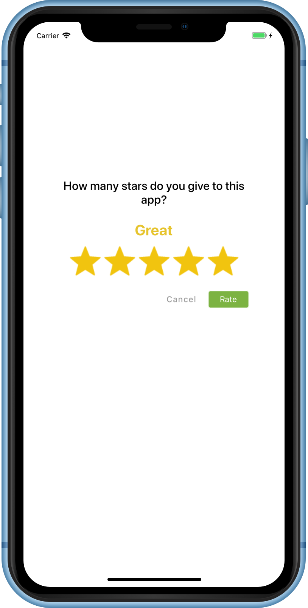
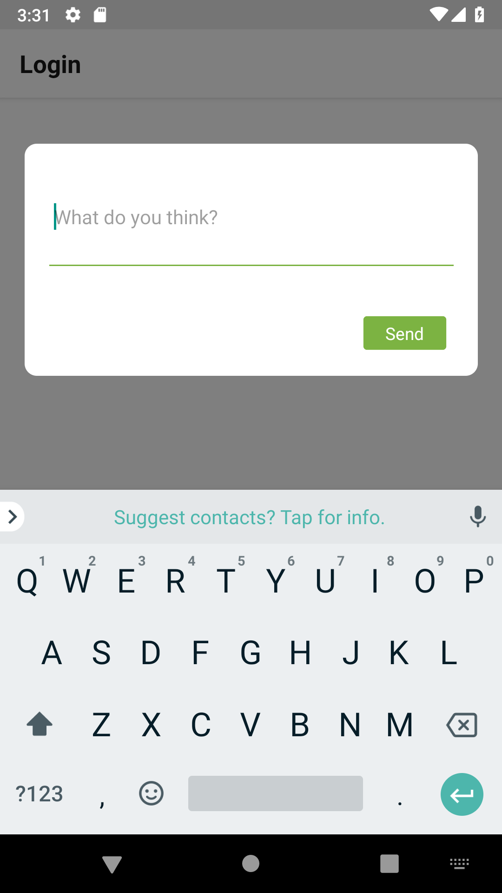

<div align="center">
 
  &nbsp;&nbsp;&nbsp;&nbsp;&nbsp;&nbsp;&nbsp;&nbsp;&nbsp;&nbsp;&nbsp;&nbsp;
 
</div>

<br/>
<div align="center"> <h3>React Native Store Rating<h3></div>

<div align="center"> React Native Module to getting users to easily rate your app.</div>
<div align="center"> 
<br/>

[](https://www.npmjs.com/package/@pankod/react-native-store-rating)
[](https://www.npmjs.com/package/@pankod/react-native-store-rating)
[](https://david-dm.org/pankod/react-native-store-rating)
[](https://david-dm.org/pankod/react-native-store-rating?type=dev)

<br/>
  <sub>Created by <a href="https://www.pankod.com">Pankod</a></sub>
</div>
<br/>
<br/>

Ratings and reviews influence how your app ranks in search results, and can affect whether someone downloads your app. Users can rate your app on a scale of desired amount of stars. They can also add a written review for iOS and Android apps.


## Stores Supported:
| **Apple App Store**  |   **Google Play**  |  
:--------------------------------------------------------------------------------------------------------------------------------------: | :-------------------------------------------------------------------------------------------------------------------------------------: | 
| **✓** | **✓** | 
|  |  | 


## Getting started
```
$ npm install react-native-store-rating --save
```

or

```
$ yarn add react-native-store-rating
```

## Usage
Users are presented with a modal allowing them to choose amount of stars which is defined with `totalStarCount` props.

The star rate taken from the users is compared to the value defined in "storeRedirectThreshold". If this value is greater than the value of "storeRedirectThreshold", the user is directed to the App store or Google Play Store. If it is equal and smaller, comment popup will be opened and users will be allowed to type comment.

Example: Let's say we defined 3 as a value to `storeRedirectThreshold` property,
```javascript
<RateModal
	storeRedirectThreshold={3}
	// ... props
/>
```

User redirect to App Store or Google Play Store when the given star rate is greater then 3.

Comment modal will be opened if the given star rate equal or less then 3.


## Example
```javascript
import React, { Component } from 'react'
import { Text, View, StyleSheet, TouchableOpacity } from 'react-native'

import RateModal from 'react-native-store-rating'

export default class example extends Component {
	state = {
		isModalOpen: false
	}

	const styles = StyleSheet.create({
		container: {
			flex: 1,
			justifyContent: 'center',
			alignItems: 'center'
		}
	})

	render() {
		return (
			<View style={styles.container}>
				<TouchableOpacity onPress={() => this.setState({ isModalOpen: true })}>
				<Text> Open Modal </Text>
			</TouchableOpacity>

			<RateModal
				rateBtnText={'Rate'}
				cancelBtnText={'Cancel'}
				totalStarCount={5}
				defaultStars={5}
				isVisible={true}
				sendBtnText={'Send'}
				commentPlaceholderText={'Placeholder text'}
				emptyCommentErrorMessage={'Empty comment error message'}
				iTunesStoreUrl={'market://details?id=${APP_PACKAGE_NAME}'}
				isModalOpen={this.state.isModalOpen}
				storeRedirectThreshold={3}
				style={{
					paddingHorizontal: 30,
				}}
				onStarSelected={(e) => {
					console.log('change rating', e);
				}}
				onClosed={() => {
					console.log('pressed cancel button...')
						this.setState({
						isModalOpen: false
					})
				}}
				sendContactUsForm={(state) => {
					alert(JSON.stringify(state));
				}}
			/>

			</View >
		)
	}
}

```

<br/>

## Options
<br/>

| Properties | Type | Description |Default |
|------------|-------------------------------------|-------------|----------------------------------------------------------------|
| **playStoreUrl** <br> **required* | `string`  | Google Play Store App Url <br> `market://details?id=${APP_PACKAGE_NAME}` | | 
| **iTunesStoreUrl** <br> **required* | `string`  | Apple ITunes App Url <br> `itms-apps://itunes.apple.com/app/${APP_ID}`| | 
| **rateBtnText**   | `string` | The button text.    | `"Rate"`        | 
| **cancelBtnText**  | `string`  | The cancel button text.  | `"Cancel"`  | 
| **totalStarCount**     | `number`     | The starts count on modal.   | `5` | 
| **defaulRating** | `number` | If no number set, it will determine 3 stars rating.               |  `5` | 
| **isVisible**      | `boolean` | Shows rating on modal. | ` true`   | 
| **sendBtnText** | `string`  | The text of send button. | `"Send"` |  
| **commentPlaceholderText** | `string` | User review modal placeholder text. | `"You can write your comments here"` | 
| **isTransparent** |`boolean` | Background style | `true` | 
| **starLabels** | `array` | The array of rating title. | `['Terrible', 'Bad', 'Okay', 'Good', 'Great']` | 
| **emptyCommentErrorMessage** | `string`  | User review comment box validation text | `"Please specify your opinion."` | 
| **isModalOpen** | `boolean`  | Control if the modal open or not. | `false` | 
| **storeRedirectThreshold** | `number`  | ? | `3` | 
| **style** | `Object`  | An object containing the styles objects to style the modal. | `example:`<br>`{ backgroundColor: #000, paddingHorizontal: 30 }` | 

<br/>

## Functions
<br/>

| Properties | Type | Description |Default |
|------------|-------------------------------------|-------------|----------------------------------------------------------------|
| **onStarSelected** | `Function`  | Function fired when the rating has changed.| `return: number` | 
| **onClosed** | `Function`  | Function fired when the modal has closed.| `console.warn('pressed cancel button...')` | 
| **sendContactUsForm** <br> **required* | `Function`  | Read component state and function fired when send bottom click | `{ isModalOpen: true, rating: 3, review: "Lorem ipsum dolor sit amet...", reviewError:false, showContactForm:true }` | 
<br/>


#### Notes

As of version 1.1.0 this package is compatible with both iOS and Android.

#### Releases
- 1.0.0 - Initial release
- 1.1.0 - Some props and functions name changed && added example app.


